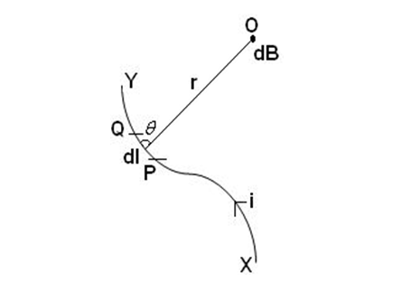
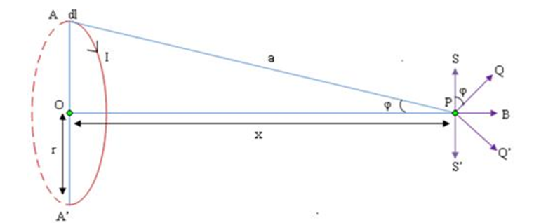

The magnetic field created by a current carrying coil can be determined using Biot-Savart's law. According to the law, the magnetic field at a point P due to a small current element dl at a distance r from P is given by:  
B = (μ0 * I * dl * sin(θ)) / (4 * π * r2)   
Where: 
<b>B</b> is the magnetic field, 
<b>μ0</b> is the permeability of free space, 
<b>I</b> is the current in the wire, 
<b>dl</b> is a segment of the wire, 
<b>θ</b> is the angle between the direction of the current and the direction to the point where the magnetic field is being measured, 
<b>r</b> is the distance from the wire to the point where the magnetic field is being measured. 

 
The magnetic field at a point along the axis of a current carrying coil decreases with increasing distance from the coil. This can be seen from the fact that the magnetic field is inversely proportional to the distance r.  
The radius of the coil can be estimated by measuring the magnetic field at various points along the axis of the coil and using the above equation. By comparing the measured magnetic field with the calculated magnetic field using the Biot-Savart law, the radius of the coil can be estimated. 
The magnetic field along the axis of the coil can be obtained by summing the contributions of all the current elements in the coil.  
The radius of the coil can be estimated using the formula for the magnetic field B, the number of turns N, and the current I in the coil:  
<b></b>B = (μ0 * N * I) / (2 * R)</b>   
Where R is the radius of the coil. Solving for R and substituting known values, the radius of the coil can be calculated.  

